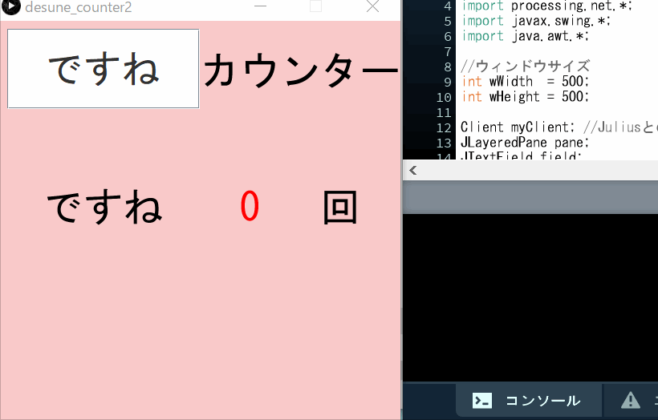

「ですね」カウンター
----

ただひたすら、指定されたワードが話された回数を数えます。



## 実行方法
1. このリポジトリをcloneまたはダウンロードして、入手してください。
1. [Releases](https://github.com/t-iwabuchi/desune_counter/releases)より`dictation-kit-4.5.zip`をダウンロードして解凍し、`dictation-kit-4.5`ディレクトリを`desune_counter.pde`と同じディレクトリに配置してください。
1. `dictation-kit-4.5/run-win-gmm-modified.bat`を起動してください。
多少の遅延が生じるかわりに高精度を求める場合は、`dictation-kit-4.5/run-win-dnn-modified.bat`を起動してください。
1. `desune_counter.pde`を、Processingで実行します。

「ですね」以外をカウントしたい場合は、`desune_counter.pde`にある以下の行（25行目付近）の「ですね」を変更してください。
```
desune = "ですね";
```

## 使用しているもの
* Processing (https://processing.org/)
* Swing(GUIライブラリ)
* Julius(汎用大語彙連続音声認識エンジン) (https://julius.osdn.jp/)

## ライセンス
本プログラムはパブリックドメインです。  
ただし、`dictation-kit-4.5`ディレクトリ以下は「Juliusディクテーションキット」のライセンスが適用されます。
`dictation-kit-4.5`ディレクトリに同梱されている`LICENSE.txt`に従ってください。

## 参考
こちらのWebサイトを参考にさせていただきました。  
ありがとうございます。

* [JuliusとProcessingを連携させる - 今を生きる20代男子の走り書き](http://rukae.hatenablog.com/entry/2019/01/07/190000)
* [juliusをモジュールモードで動かす　Processing - gutugutu3030](https://sites.google.com/site/gutugutu30/other/juliuswomojurumododedongkasuprocessing)
